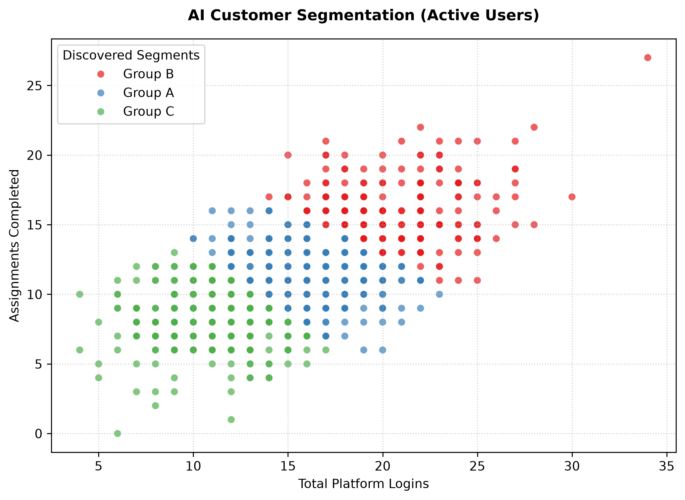

# End-to-End User Retention & Revenue Operations Pipeline

## Executive Summary
This repository contains a dual-track analytical project designed to optimize business health for a subscription-based digital platform. The project bridges advanced data engineering, predictive machine learning, and automated business intelligence to solve two major corporate problems: **Predicting customer churn** and **automating financial revenue tracking**.

The architecture combines a production-grade **Excel/DAX relational data engine** with an advanced **Python predictive modeling pipeline** to deliver actionable insights directly tied to financial performance.

---

## Technical Stack & Tools
* **Data Pipelines & Modeling:** Excel Power Query, Relational Data Model
* **Business Intelligence & Analytics:** Advanced DAX (`CALCULATE`, `ALL`, `DIVIDE`)
* **Predictive Modeling (Supervised Machine Learning):** Python, Scikit-Learn, Random Forest Classifier
* **Customer Segmentation (Unsupervised Machine Learning):** K-Means Clustering, StandardScaler
* **Data Visualization:** Seaborn, Matplotlib

---

## Part 1: Automated Revenue Operations Engine (Excel & DAX)
To eliminate manual data entry and brittle formulas, an automated ETL (Extract, Transform, Load) pipeline was engineered directly into the background database engine.

### Data Architecture & Automation
1. **Automated Ingestion:** Built a Power Query folder-watcher pipeline that automatically aggregates, cleans, and formats multiple transactional CSV files dynamically upon refresh.
2. **Relational Data Model:** Established a star schema within the compressed Data Model, linking transaction records to dimension tables without relying on performance-heavy functions like `VLOOKUP` or `XLOOKUP`.
3. **Advanced DAX Analytics:** Bypassed standard pivot functions to write custom, memory-efficient DAX measures to control and manipulate evaluation contexts:
   * **Base Aggregation:** `Total_Revenue:= SUM(Raw_Sales_Data[Revenue])`
   * **Contextual Overrides:** `Electronics_Revenue:= CALCULATE([Total_Revenue], Raw_Sales_Data[Product_Category] = "Electronics")`
   * **Dynamic Ratios:** `Pct_of_Total_Revenue:= DIVIDE([Total_Revenue], CALCULATE([Total_Revenue], ALL(Raw_Sales_Data[Product_Category])))`

### Business Intelligence Output
The DAX engine successfully extracts performance metrics across core product segments dynamically:
* **Electronics:** Driving **56%** of gross revenue (₹825)
* **Hardware:** Driving **24%** of gross revenue (₹360)
* **Accessories:** Driving **20%** of gross revenue (₹300)

---

## Part 2: Predictive Retention & Behavioral Analytics (Python)
Using the structured pipeline data, an advanced machine learning engine was deployed to proactively address customer churn.

### 1. Supervised Learning: Churn Driver Analysis
A **Random Forest Classifier** (100 estimators) was trained to evaluate user engagement patterns and isolate the exact features driving subscription cancellations.
* **Mathematical Optimization:** Extracted Gini feature importances to calculate the explicit impact of specific user metrics.
* **Key Finding:** `Assignments_Completed` dictates **60%** of the model's decision-making weight, while `Platform_Logins` accounts for **40%**. 
* **Strategic Insight:** Getting users to log in is a vanity metric. If active users are not completing milestones/assignments, they remain an extremely high churn risk.

### 2. Unsupervised Learning: Behavioral Customer Segmentation
To discover hidden behavioral profiles among non-churned clients, a **K-Means Clustering** algorithm was deployed on scaled user engagement data, discovering three explicit customer personas:

| Customer Segment | Avg. Platform Logins | Avg. Assignments Completed | Active User Count | Risk Profile / Business Action |
| :--- | :---: | :---: | :---: | :--- |
| **Group B (Power Users)** | 21.1 | 16.2 | 184 Users | **Negligible Risk:** High-value advocates; prime targets for premium upsells. |
| **Group A (Core Learners)** | 16.1 | 11.4 | 374 Users | **Stable:** Healthy, steady engagement; baseline retention group. |
| **Group C (At-Risk Casuals)** | 11.1 | 8.1 | 289 Users | **Critical Churn Danger:** Highly active but underperforming. Requires immediate automated re-engagement workflows. |

### Visualizing the Segments
The K-Means algorithm mathematically isolated the user base into distinct behavioral spaces based on Euclidean distance:

---

## Business Value Generated
* **System Automation:** Replaced manual data assembly processes with a single-click refresh pipeline, mitigating human entry errors.
* **Proactive Revenue Protection:** Shifted company strategy from reactive post-churn analysis to proactive intervention by identifying the **289 active users** sitting in the critical danger zone.
* **Product-Led Growth:** Provided mathematical evidence that product engineering resources must prioritize assignment completion features over generic login incentives to effectively protect monthly recurring revenue (MRR).